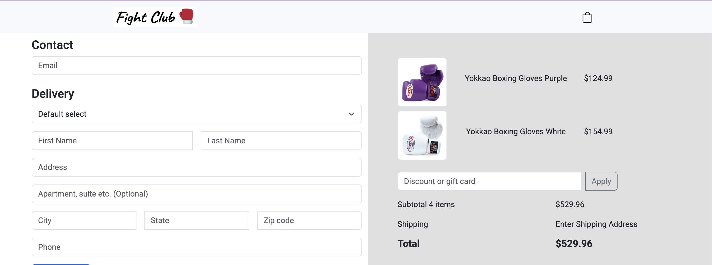
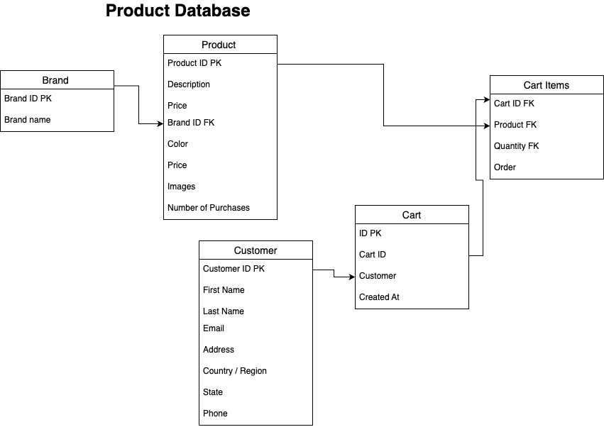

# 🛍️ Hello everyone this is a Full Stack Web Application E-Commerce Store that is organized by brands. Its built with React, Django, and PostgreSQL.

## Tools Used

- Django REST Framework for API structure
- ⚙️ Global state management with Redux Toolkit
- PostgreSQL for structured realtional data
- Using Redux for cart data including local storage
- 🧪 Implemented integration tests to validate API responses are accurately reflected in the frontend UI using VItest

## Stack

- Frontend: React + Boostrap
- Backend: Django + Django REST Framework
- Database: PostgreSQL

## 🧱 Challenges Faced

- How to structure the database of the store specifically why two cart tables (Cart and Cart_Items)
- Modifying data usage in order to access it in frontend
- To either use AWS S3 to store product images in database
- Dealing with global state management first used useContext then used Redux being more optimal.

Here are a couple of preview pics of how it looks like

Store database

